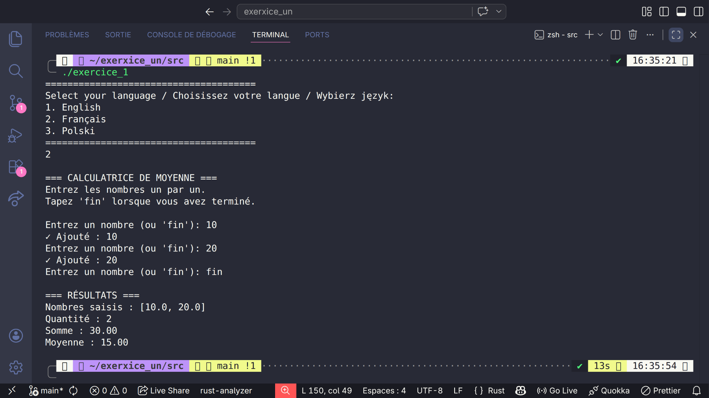
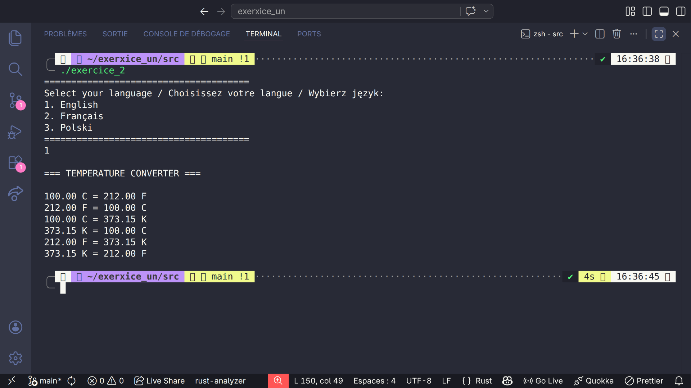
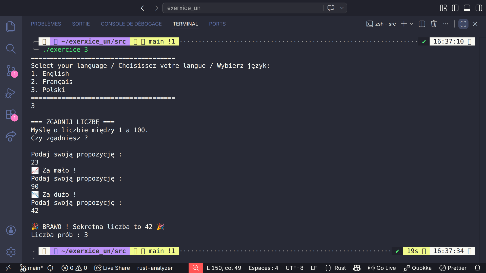

# 🦀 Rust Beginner Exercises

[English](#english) | [Français](#français) | [Polski](#polski)

---

## English

### Description

My first 3 exercises in Rust - Learning the basics of the language.

### Exercises

1. **Variables and types** - Basic data manipulation
2. **Loops** - Control flow with loops
3. **Match expressions** - Pattern matching

### How to run

` + "`" + "`" + "`" + `bash
cargo run
` + "`" + "`" + "`" + `

---

## Français

### Description

Mes 3 premiers exercices en Rust - Apprentissage des bases du langage.

### Exercices

1. **Variables et types** - Manipulation basique des données
2. **Boucles** - Contrôle de flux avec des boucles
3. **Expressions match** - Filtrage par motifs

### Comment exécuter

` + "`" + "`" + "`" + `bash
cargo run
` + "`" + "`" + "`" + `

---

## Polski

### Opis

Moje pierwsze 3 ćwiczenia w Rust - Nauka podstaw języka.

### Ćwiczenia

1. **Zmienne i typy** - Podstawowa manipulacja danymi
2. **Pętle** - Sterowanie przepływem z pętlami
3. **Wyrażenia match** - Dopasowywanie wzorców

### Jak uruchomić

` + "`" + "`" + "`" + `bash
cargo run
` + "`" + "`" + "`" + `

---

## 📸 Screenshots

### Exercice 1 - Average Calculator

### Exercice 2 - Temperature Converter

### Exercice 3 - Guess the Number

## License

MIT
